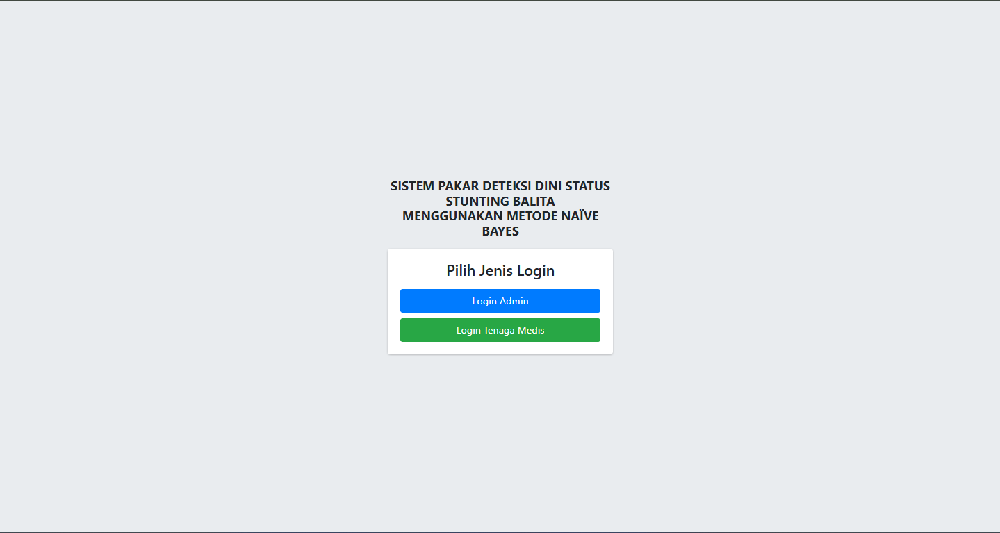
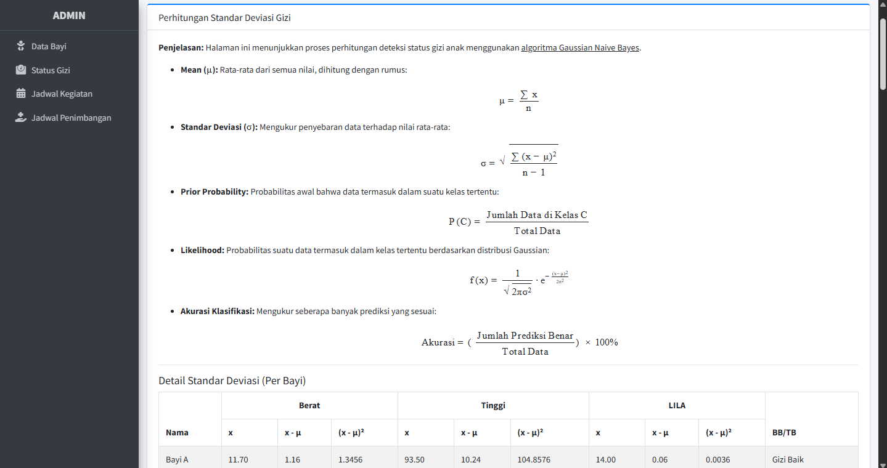
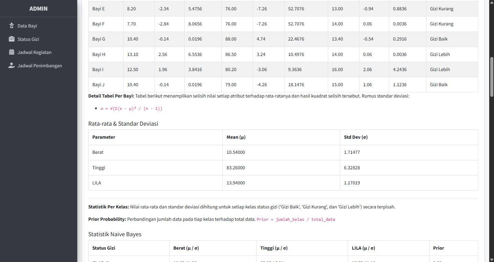
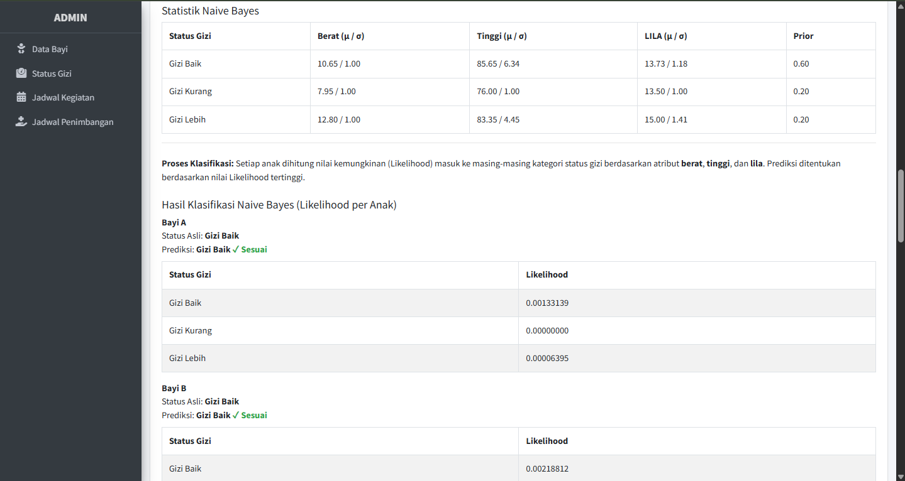
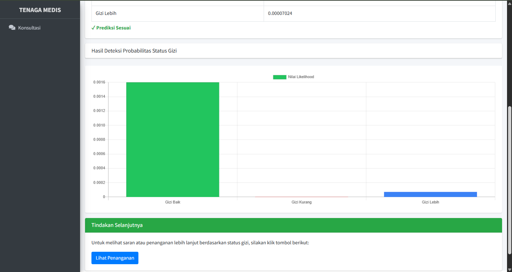
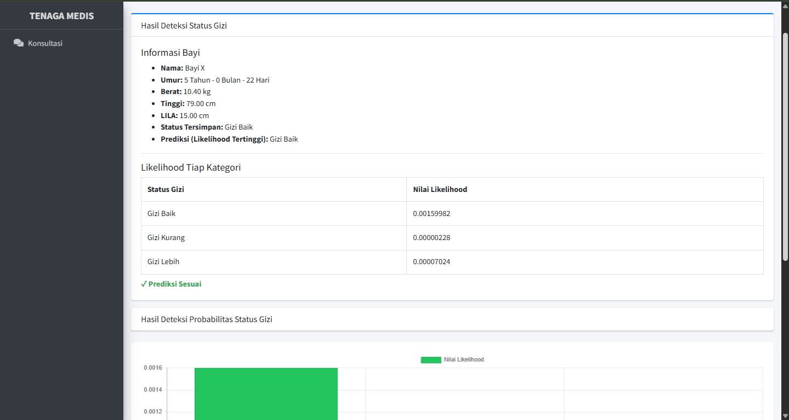

# SISTEM PAKAR DETEKSI DINI STATUS STUNTING BALITA MENGGUNAKAN METODE NAÏVE BAYES

**Aplikasi Sistem Pakar berbasis Laravel 12 untuk mendeteksi status stunting pada balita menggunakan metode Naïve Bayes.**

## 📌 Deskripsi Singkat

Aplikasi ini digunakan untuk mendeteksi dini status gizi balita berdasarkan data antropometri (berat badan, tinggi badan, lingkar lengan atas) dan klasifikasi status gizi dengan metode Naïve Bayes. Sistem ini mendukung proses pengambilan keputusan oleh tenaga medis dalam memantau status pertumbuhan anak secara cepat dan akurat.

### Kriteria Input:

-   Berat Badan (kg)
-   Tinggi Badan (cm)
-   LILA (cm)
-   Jenis Kelamin
-   Umur

### Output:

-   Status Gizi (Gizi Baik, Gizi Kurang, Gizi Lebih)
-   Probabilitas per status
-   Hasil prediksi dengan nilai tertinggi

## 🖥️ Tampilan Aplikasi

### Halaman Login



### Halaman Perhitungan





### Halaman Hasil Deteksi





## ⚙️ Persyaratan Sistem

-   PHP 8.x ke atas
-   Composer
-   MySQL
-   Ekstensi PHP yang dibutuhkan:
    -   PDO
    -   Mbstring
    -   Tokenizer
    -   XML
    -   Fileinfo
    -   Zip

### Cara Mengaktifkan Ekstensi ZIP:

**XAMPP:**

-   Buka `php.ini`
-   Cari `;extension=zip` lalu hapus tanda `;`
-   Restart Apache

**Laragon:**

-   Klik kanan icon tray > PHP > php.ini
-   Hapus `;` pada `extension=zip`
-   Restart Apache

## 🚀 Cara Menjalankan Proyek

1. Clone repository ini
2. Masuk ke folder proyek:
    ```bash
    cd spk-stunting-laravel
    ```
3. Install dependency:
    ```bash
    composer install
    ```
4. Copy file `.env`:
    ```bash
    .env.example .env
    ```
5. Atur konfigurasi database di file `.env`
6. Generate application key:
    ```bash
    php artisan key:generate
    ```
7. Jalankan migrasi:
    ```bash
    php artisan migrate
    ```
8. Jalankan seeder:
    ```bash
    php artisan db:seed dan php artisan db:seed DataBayiSeeder
    ```
9. Jalankan server lokal:
    ```bash
    php artisan serve
    ```
10. Akses melalui browser:
    ```
    http://127.0.0.1:8000
    ```

## 👥 Akun Login Default

| Role        | Username    | Password    |
| ----------- | ----------- | ----------- |
| admin       | admin       | admin       |
| temagamedis | tenagamedis | tenagamedis |

---

## 🔍 Keywords SEO

```
SPK Stunting Balita, Naive Bayes Laravel, Sistem Pakar Gizi Anak, Deteksi Dini Stunting, Laravel SPK Naive Bayes, Balita Status Gizi
```

## 📌 Credits

This project is developed and maintained by [Masmut Dev](https://masmutdev.com), a Fullstack Developer from Indonesia. Dedicated to building smart systems with clean architecture and practical UI/UX.

© 2025 [Masmut Dev](https://masmutdev.com) – All Rights Reserved.

Lisensi: MIT
